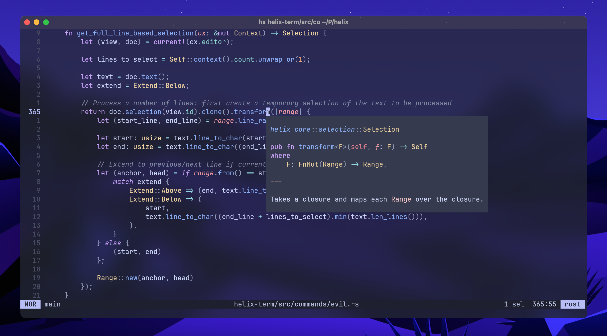

<div align="center">

<h1>evil-helix</h1>

A soft fork of [Helix](https://helix-editor.com) which introduces Vim keybindings and more.

[](https://github.com/usagi-flow/evil-helix/actions/workflows/evil-build-tag.yml)



<hr />

</div>

> [!IMPORTANT]
> This project often integrates the latest Helix changes, but should be stable enough for daily usage.

## Installation

[Download a package](https://github.com/usagi-flow/evil-helix/releases) and extract it in `/opt`. Additionally, it's recommended to symlink it in `/usr/local/bin`:

```sh
cd /opt
sudo curl -Lo helix.tar.gz https://github.com/usagi-flow/evil-helix/releases/download/release-<VERSION>/helix-<ARCH>-<OS>.tar.gz
sudo tar -xf helix.tar.gz
cd /usr/local/bin
sudo ln -sv /opt/helix/hx .
```

### Package manager

If a package is available for your system's package manager, it's the recommended way to install evil-helix.

[](https://repology.org/project/evil-helix/versions)

## Current state

These are the current differences compared to the upstream project:

-	Vim keybindings (_feel free to file an issue if you're missing certain bindings_):
	-	Commands: `c`, `d`, `y`, `x`
	-	Modifiers: `i`
	-	Motions: `w`, `0`, `$`
-	Basic Vim modeline support ([#3](https://github.com/usagi-flow/evil-helix/pull/3))
-	Adjusted defaults ([511060a](https://github.com/usagi-flow/evil-helix/commit/511060abcfcbe9377ec50e8a0ecaf4c0660776bb)):
	-	The Helix "SEL" mode is called "VIS"
	-	Smart tab is disabled by default
-	If `color_modes` is enabled, color the file type in the statusline as well ([5503542](https://github.com/usagi-flow/evil-helix/commit/5503542c0314936ea91464f2944666ed42fea86c))
-	Minimalistic window separator ([dd990ca](https://github.com/usagi-flow/evil-helix/commit/dd990cad1cb92a024321aca19728c68cb066dd09))

Moreover, evil-helix introduces the `editor.evil` option, which is `true` by default. It can be set to false to completely deactivate evil-helix behavior without having to use a different build:

```toml
[editor]
evil = true # Default; set this to `false` to disable evil-helix behavior
```

## Project philosophy

### Configurable features instead of plugins

This fork seeks to implement functionality as part of the editor, and make it configurable.
The added functionality includes a Vim look-and-feel, but also other features.

In contrast, the upstream project, Helix, mostly limits its scope to its current core functionality, and defers further functionality to the future Scheme-based plugin system.

Compared to plugins, implementing features as part of the editor greatly improves performance, and avoids the risk of plugin compatibility issues.

### Sensible defaults

In addition, sensible defaults are crucial:
The editor must offer a wide range of tools for your job, but it must do what you expect an editor to do.

### Avoid Scheme/Lisp

Scheme/Lisp should not be forced onto the user.
It's error-prone and harder to read by humans, compared to Rust/TOML/Lua/...

If upstream Helix moves to a [Scheme-based configuration](https://github.com/helix-editor/helix/issues/10389),
this project will seek to keep a user-friendly alternative.

### Soft fork

This project is a "soft fork", i.e. it remains compatible with the upstream and regularly rebases its changes on top of the upstream master branch. New features should be carefully isolated from the upstream codebase in order to avoid conflicts.

Whether this project remains in this state will depend on how much this project's philosophy and the upstream project diverge, although a hard fork should be considered as a last resort.

### Small and regular version releases

Considering the kind and frequency of changes to this repository, it makes sense to release small changes often, rather than holding features back in large releases. Releases are currently tagged on-demand.

## Project goals

-	Consider a better name for this project
	-	Move the project into an organization
-	Improve and stabilize the CI
-	Introduce more Vim keybindings
-	Implement more common/crucial features as part of the editor:
	-	File tree (cf. [upstream PR](https://github.com/helix-editor/helix/pull/5768))
	-	Light/dark mode support
-	Maintain compatibility with upstream
	-	Contribute features to upstream where possible
	-	Ensure (through CI) that rebasing is always possible

## Development

Keep in mind the `main` branch may be rebased onto the upstream `master` branch.